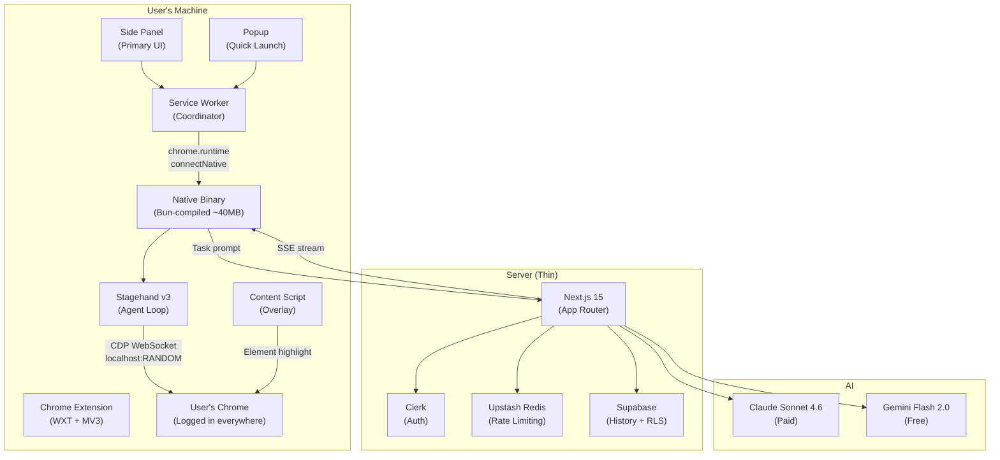

# Dart — Personal AI Browser Agent

A Chrome extension that connects to the user's real browser via CDP and executes natural language commands autonomously, step by step, in real time.

---

## Architecture Summary



---

## Resolved Design Decisions

The following questions have been reviewed and resolved:

> [!NOTE]
> **✅ Styling Strategy:** Tailwind v4 for side panel and popup (isolated extension contexts). Vanilla CSS for content script overlay (Shadow DOM compatibility). The overlay is <50 lines of CSS — Tailwind adds no value there.

> [!NOTE]
> **✅ CDP Approach:** Stagehand v3 native CDP — no Playwright dependency. Uses Stagehand's `cdpUrl` configuration in `localBrowserLaunchOptions`. Simpler, faster (44% performance improvement).

> [!NOTE]
> **✅ Clerk Side Panel Auth Sync:** Use `chrome.storage.onChanged` to detect when Clerk's session token is written and auto-reload the side panel. No manual close/reopen required. The side panel listens for storage changes and calls `window.location.reload()` when the Clerk session token appears.

> [!NOTE]
> **✅ Chrome Launch Strategy:** Detect existing debug endpoint → connect if found → otherwise relaunch Chrome with the user's existing `--user-data-dir` and `--restore-last-session`. **Never open a fresh profile.** Decision tree:
> 1. Check if Chrome is already running with a debug port → `GET http://localhost:9222/json/version` (or scan common ports) → If yes: connect directly, skip relaunch
> 2. If not found: find user's default Chrome profile path (OS-specific) → show one-time warning: "Dart needs to restart Chrome to enable browser control. Your sessions and tabs will be preserved." → kill existing Chrome process → relaunch with `--remote-debugging-port={randomPort}`, `--remote-allow-origins=http://localhost:{randomPort}`, `--user-data-dir={existing default profile path}`, `--restore-last-session` → wait for CDP endpoint → connect Stagehand
>
> Profile paths per OS:
> - macOS: `${home}/Library/Application Support/Google/Chrome`
> - Windows: `${home}/AppData/Local/Google/Chrome/User Data`
> - Linux: `${home}/.config/google-chrome`

> [!NOTE]
> **✅ Native Binary Distribution:** Single pipeline approach:
> - **Phase 2:** Local dev script (`scripts/dev-install.sh` + `scripts/dev-install.ps1`) for developer testing only — compiles binary with `bun build --compile`, registers native messaging host manifest on your own machine. Not a published package, not a product feature.
> - **Phase 2 (also):** Set up GitHub Actions release workflow — compiles binary for macOS/Windows/Linux on every git tag push, uploads as release assets. This is the **single distribution pipeline** used all the way through Phase 5+.
> - **Phase 5:** Build a static `/download` page with three OS-specific buttons linking to the latest GitHub Release assets. No code signing initially — users click through OS security warning. No npm package at any point. Homebrew/Chocolatey/Scoop explicitly deferred to post-launch.

> [!NOTE]
> **✅ Model Versions:** Pin to specific versions for reliability (`claude-sonnet-4-20250514`, `gemini-2.0-flash`). Expose a model selector for Power tier users only.

> [!CAUTION]
> **✅ RLS Bug Fix (Critical):** The original `drizzle/rls.sql` used `auth.uid()` which is a **Supabase Auth** function. With Clerk, `auth.uid()` returns `null` — all RLS policies would either block everything or pass everything. **Resolution:** Delete all RLS policies that use `auth.uid()`. Enforce user scoping entirely in Next.js API routes using the Supabase **service role key**. Every database query must filter by `userId` in application code (e.g., `where(eq(tasks.userId, clerkUserId))`).

---

## Tech Stack Suggestions & Improvements

I agree with the stack as specified but have a few senior-engineer recommendations:

| Area | Your Spec | My Recommendation | Why |
|---|---|---|---|
| Agent framework | Stagehand v3 via Playwright CDP | Stagehand v3 **native CDP** (no Playwright) | v3 is CDP-native; Playwright is dead weight |
| Content script styles | Tailwind v4 in Shadow DOM | **Vanilla CSS** for content script overlay only | `@property` incompatibility; overlay is trivial CSS |
| Error tracking | Not mentioned | **Sentry** (free tier) | Production-critical — you need crash reports from the binary and extension |
| Logging | Not mentioned | **pino** (in native binary) + structured JSON logs | Essential for debugging agent failures; logs stay local for privacy |
| Schema sharing | Zod in `packages/shared` | ✅ Agreed, plus add **ts-pattern** for exhaustive pattern matching on `AgentAction` discriminated unions | Prevents "forgot to handle action type X" bugs |
| E2E testing | Not mentioned | **WXT's built-in testing** + **Vitest** for unit tests | Must test extension message passing and agent loop logic |
| CDPsession mgmt | Manual | Stagehand's built-in session management | Stagehand v3 handles CDP lifecycle; don't reinvent |

---

## Monorepo Structure

```
dart/
├── apps/
│   ├── extension/                  # WXT Chrome extension
│   │   ├── entrypoints/
│   │   │   ├── sidepanel/          # Primary UI (React)
│   │   │   │   ├── index.html
│   │   │   │   ├── main.tsx
│   │   │   │   └── App.tsx
│   │   │   ├── popup/              # Quick-launch (React)
│   │   │   │   ├── index.html
│   │   │   │   ├── main.tsx
│   │   │   │   └── App.tsx
│   │   │   ├── background.ts       # Service worker
│   │   │   └── content.ts          # Content script (overlay)
│   │   ├── components/             # Shared UI components
│   │   ├── hooks/                  # Custom React hooks
│   │   ├── stores/                 # Zustand stores
│   │   ├── lib/                    # Extension utilities
│   │   ├── assets/                 # Icons, images
│   │   ├── wxt.config.ts
│   │   ├── tailwind.config.ts
│   │   ├── tsconfig.json
│   │   └── package.json
│   │
│   └── web/                        # Next.js 15 app
│       ├── app/
│       │   ├── (marketing)/        # Public routes
│       │   │   ├── page.tsx        # Homepage
│       │   │   ├── pricing/
│       │   │   └── changelog/
│       │   ├── dashboard/          # Protected routes
│       │   │   ├── page.tsx
│       │   │   └── layout.tsx
│       │   └── api/
│       │       ├── agent/
│       │       │   ├── run/route.ts
│       │       │   └── cancel/route.ts
│       │       └── task/
│       │           ├── save/route.ts
│       │           └── history/route.ts
│       ├── lib/
│       │   ├── rate-limit.ts       # Upstash rate limiter
│       │   ├── db.ts               # Drizzle client
│       │   └── auth.ts             # Clerk helpers
│       ├── drizzle/
│       │   ├── schema.ts           # Drizzle table definitions
│       │   └── migrations/         # Generated migrations
│       ├── middleware.ts           # Clerk auth middleware
│       ├── next.config.ts
│       ├── tailwind.config.ts
│       ├── tsconfig.json
│       └── package.json
│
├── packages/
│   ├── agent/                      # Agent loop logic
│   │   ├── src/
│   │   │   ├── loop.ts            # Main agent loop
│   │   │   ├── actions.ts         # Action executors
│   │   │   ├── planner.ts         # Claude integration
│   │   │   ├── observer.ts        # Stagehand observe wrapper
│   │   │   ├── pacing.ts          # Human-like delays
│   │   │   └── index.ts
│   │   ├── tsconfig.json
│   │   └── package.json
│   │
│   ├── native/                     # Native messaging host
│   │   ├── src/
│   │   │   ├── host.ts            # Main entry (stdin/stdout protocol)
│   │   │   ├── chrome-launcher.ts  # Chrome launch + CDP setup
│   │   │   ├── messaging.ts       # Message encode/decode (4-byte prefix)
│   │   │   ├── cdp.ts             # CDP connection manager
│   │   │   └── index.ts
│   │   ├── scripts/
│   │   │   ├── dev-install.sh     # macOS/Linux dev install
│   │   │   └── dev-install.ps1    # Windows dev install
│   │   ├── tsconfig.json
│   │   └── package.json
│   │
│   ├── shared/                     # Shared types + schemas
│   │   ├── src/
│   │   │   ├── schemas/
│   │   │   │   ├── messages.ts    # Extension ↔ binary messages
│   │   │   │   ├── actions.ts     # AgentAction discriminated union
│   │   │   │   ├── steps.ts       # Step events
│   │   │   │   └── tasks.ts       # Task schemas
│   │   │   ├── types/
│   │   │   │   ├── agent.ts       # Agent types
│   │   │   │   ├── plans.ts       # Pricing plan types
│   │   │   │   └── index.ts
│   │   │   └── index.ts
│   │   ├── tsconfig.json
│   │   └── package.json
│   │
│   └── tsconfig/                   # Shared TS configs
│       ├── base.json
│       ├── react.json
│       ├── node.json
│       └── package.json
│
├── .github/
│   └── workflows/
│       └── release.yml             # Build + upload binaries on tag push
│
├── turbo.json
├── pnpm-workspace.yaml
├── package.json
├── .env.example
├── .gitignore
├── .prettierrc
├── .eslintrc.js
└── README.md
```

---

## Phase 1 — Monorepo Scaffold + Chrome Extension Shell

**Goal:** A working Chrome extension installed in local Chrome, with a side panel that opens, a popup that launches it, and bidirectional message passing between side panel ↔ service worker ↔ content script.

### Deliverables

---

#### Monorepo Root

##### [NEW] `pnpm-workspace.yaml`
Defines workspace packages: `apps/*` and `packages/*`.

##### [NEW] `turbo.json`
Task pipeline configuration with `build`, `dev`, `lint`, `typecheck` tasks. Build depends on `^build` (topological). Dev is persistent and uncached. Outputs include `.next/**`, `.output/**`, `dist/**`.

##### [NEW] `package.json` (root)
Root workspace with `turbo`, `prettier`, `eslint` as devDependencies. Scripts: `dev`, `build`, `lint`, `typecheck`, `clean`. Engine constraint: `node >=20`, `pnpm >=9`.

##### [NEW] `.gitignore`
Standard monorepo ignores: `node_modules`, `.next`, `.output`, `dist`, `.env.local`, `.env.*.local`, `.turbo`.

##### [NEW] `.prettierrc`
Standard config: single quotes, semicolons, 2-space indent, trailing comma all.

##### [NEW] `.eslintrc.js`
Root ESLint extending `eslint:recommended`, `@typescript-eslint/recommended`. No `any` rule enforced.

##### [NEW] `.env.example`
Template for all environment variables needed across the project.

---

#### `packages/tsconfig/`

##### [NEW] `base.json`
Strict TypeScript base config: `strict: true`, `noUncheckedIndexedAccess: true`, `exactOptionalPropertyTypes: true`, `noImplicitReturns: true`, `forceConsistentCasingInFileNames: true`, `moduleResolution: bundler`, `target: ES2022`.

##### [NEW] `react.json`
Extends base. Adds `jsx: react-jsx`, `lib: ["DOM", "DOM.Iterable", "ES2022"]`.

##### [NEW] `node.json`
Extends base. Adds `module: ESNext`, `lib: ["ES2022"]`, `types: ["node"]`.

##### [NEW] `package.json`
Package name `@dart/tsconfig`, private, no dependencies.

---

#### `packages/shared/`

##### [NEW] `src/schemas/messages.ts`
Zod schemas for all message types between extension and native binary. Discriminated union on `type` field. Message types:
- `task:start` — user submits a command
- `task:cancel` — user cancels running task  
- `task:pause` — user pauses agent
- `task:resume` — user resumes agent
- `step:update` — agent reports a step event
- `step:blocked` — agent hit a blocker
- `step:ask_user` — agent needs clarification
- `user:response` — user answers an `ask_user`
- `status:ready` — binary is connected and ready
- `status:error` — binary encountered an error
- `status:connected` — CDP connection established

##### [NEW] `src/schemas/actions.ts`
Zod schema for `AgentAction` discriminated union:
- `click`, `type`, `scroll`, `navigate`, `extract`, `done`, `ask_user`, `blocked`
Each variant validated with specific fields.

##### [NEW] `src/schemas/steps.ts`
Zod schema for `StepEvent`: `id`, `taskId`, `type`, `description`, `status` (pending | running | success | failed), `timestamp`, `detail` (optional).

##### [NEW] `src/schemas/tasks.ts`
Zod schema for `Task`: `id`, `command`, `status` (pending | running | paused | completed | failed | cancelled), `steps`, `createdAt`, `completedAt`.

##### [NEW] `src/types/plans.ts`
TypeScript types for pricing plans: `Plan = 'free' | 'pro' | 'power'`. Plan limits object mapping plan to daily task count.

##### [NEW] `src/types/agent.ts`
TypeScript types inferred from Zod schemas using `z.infer`.

##### [NEW] `src/index.ts`
Barrel export for all schemas and types.

##### [NEW] `package.json`
Package name `@dart/shared`. Dependency: `zod`. Extends `@dart/tsconfig/node.json`.

##### [NEW] `tsconfig.json`
Extends `@dart/tsconfig/node.json`.

---

#### `apps/extension/`

##### [NEW] `wxt.config.ts`
WXT configuration:
- `srcDir: '.'`
- `modules: ['@wxt-dev/module-react']`
- `manifest.key` — a pre-generated public key string for stable CRX ID (needed for Clerk OAuth later)
- `manifest.permissions`: `['sidePanel', 'activeTab', 'scripting', 'storage', 'tabs', 'nativeMessaging']`
- `manifest.host_permissions`: none (use `activeTab` instead)
- `manifest.name`: `'Dart — AI Browser Agent'`
- `manifest.description`: proper description
- NO `debugger` permission, NO `<all_urls>`

##### [NEW] `entrypoints/background.ts`
Service worker:
- Sets `chrome.sidePanel.setPanelBehavior({ openPanelOnActionClick: true })` so clicking icon opens side panel
- Message router: listens for `chrome.runtime.onMessage` from side panel and popup
- Forwards commands to native binary via `chrome.runtime.connectNative` (stubbed in Phase 1 — just logs to console)
- Stores task state in `chrome.storage.session`
- Exports message handler types

##### [NEW] `entrypoints/sidepanel/index.html`
HTML shell: links to `main.tsx`, includes viewport meta, title "Dart".

##### [NEW] `entrypoints/sidepanel/main.tsx`
React entry point: `createRoot` + render `<App />`.

##### [NEW] `entrypoints/sidepanel/App.tsx`
Side panel React app:
- `CommandInput` component: textarea + submit button. On Enter (without Shift), dispatches `chrome.runtime.sendMessage` with `{ type: 'task:start', command: text }`.
- `StepLog` component: renders list of steps from Zustand store (empty in Phase 1).
- Uses Tailwind v4 for styling.
- Dark theme by default.
- Clean, minimal UI with Dart branding.

##### [NEW] `entrypoints/popup/index.html`
HTML shell for popup.

##### [NEW] `entrypoints/popup/main.tsx`
React entry point for popup.

##### [NEW] `entrypoints/popup/App.tsx`
Popup React app:
- Minimal: command textarea + "Submit" button + "Open Full Panel" link.
- "Open Full Panel" calls `chrome.sidePanel.open()` (requires user gesture).
- On submit, sends command to service worker, then opens side panel.

##### [NEW] `entrypoints/content.ts`
Content script:
- Injects a Shadow DOM host element into the page.
- Inside shadow root: a `<div>` for element highlighting (glowing border overlay).
- Listens for `chrome.runtime.onMessage` for highlight instructions.
- Uses vanilla CSS (not Tailwind) inside shadow root.
- Initially renders nothing — just establishes the shadow DOM container.

##### [NEW] `stores/agent-store.ts`
Zustand store with `persist` middleware backed by `chrome.storage.session`:
- `command: string | null` — current command
- `steps: StepEvent[]` — step log
- `status: TaskStatus` — current task status
- `setCommand`, `addStep`, `setStatus` actions

##### [NEW] `lib/messaging.ts`
Typed message helpers:
- `sendToBackground(message: ExtensionMessage): Promise<Response>` — wrapper around `chrome.runtime.sendMessage`
- `onBackgroundMessage(handler)` — typed listener
- Uses Zod schemas from `@dart/shared` for validation

##### [NEW] `components/CommandInput.tsx`
Reusable command input component:
- Textarea with auto-resize
- Submit on Enter, Shift+Enter for newline
- Character count display
- Placeholder text with example commands
- Loading state (disabled during task execution)

##### [NEW] `tailwind.config.ts`
Tailwind v4 config (CSS-first). Import in the main CSS file. Custom colors for Dart brand (dark theme).

##### [NEW] `assets/` directory
Extension icons: 16x16, 32x32, 48x48, 128x128 PNG. Can start with placeholder icons.

##### [NEW] `package.json`
Dependencies: `react`, `react-dom`, `zustand`, `@dart/shared` (workspace). DevDependencies: `wxt`, `@wxt-dev/module-react`, `typescript`, `tailwindcss`, `@types/react`, `@types/react-dom`, `@types/chrome`.

##### [NEW] `tsconfig.json`
Extends `@dart/tsconfig/react.json`.

---

#### `packages/agent/` (scaffold only)

##### [NEW] `src/index.ts`
Placeholder export. Agent loop logic deferred to Phase 2.

##### [NEW] `package.json`
Package name `@dart/agent`. Dependency: `@dart/shared`, `@browserbasehq/stagehand`, `zod`.

##### [NEW] `tsconfig.json`
Extends `@dart/tsconfig/node.json`.

---

#### `packages/native/` (scaffold only)

##### [NEW] `src/index.ts`
Placeholder export. Native binary logic deferred to Phase 2.

##### [NEW] `package.json`
Package name `@dart/native`. Dependency: `@dart/shared`, `@dart/agent`.

##### [NEW] `tsconfig.json`
Extends `@dart/tsconfig/node.json`.

---

#### `apps/web/` (scaffold only)

##### [NEW] Next.js 15 app scaffolded via `npx create-next-app`
Basic structure with App Router. Placeholder pages. Full implementation deferred to Phase 3+.

---

### Terminal Commands (Phase 1)

1. `mkdir dart && cd dart` — create project root
2. `pnpm init` — initialize root package.json
3. Create `pnpm-workspace.yaml`
4. Create all package directories and files
5. `pnpm install` — install all dependencies
6. `cd apps/extension && pnpm dev` — start WXT dev server
7. Load extension in Chrome via `chrome://extensions` → Load unpacked → select `.output/chrome-mv3-dev`

### Gotchas

- **WXT side panel requires `openPanelOnActionClick: true`** in background.ts — without it, clicking the extension icon does nothing useful.
- **Stable CRX ID:** Must set `manifest.key` in `wxt.config.ts` *before* any Clerk setup. Generate one using `openssl rand -hex 32` and convert to a CRX public key format, or use a tool like Plasmo's keypair generator.
- **`chrome.storage.session` is per-session only** — data cleared on browser restart. This is intentional for task state (not persistent). Persistent data goes to Supabase.
- **Content script `matches` pattern:** Use `["<all_urls>"]` in the content script definition (this is separate from `host_permissions` — content scripts need match patterns to know where to inject). WXT handles this via the entrypoint config.
- **Zustand + chrome.storage:** The persist middleware must use an async custom storage adapter. The `createJSONStorage` helper handles this with a custom `getItem`/`setItem`/`removeItem` implementation.
- **Shadow DOM + Tailwind v4:** Do NOT attempt to use Tailwind inside the content script Shadow DOM. Use vanilla CSS only for the overlay.
- **WXT HMR:** Side panel and popup get HMR automatically. Content scripts require a manual reload of the extension. Service worker changes trigger an automatic extension reload.

### Phase Boundary

**What works:**
- Extension loads in Chrome without errors
- Clicking the extension icon opens the side panel
- Side panel shows command input with dark theme and Dart branding
- Popup shows quick-launch textarea with "Open Full Panel" link
- Typing a command and pressing Enter logs it in the service worker console
- Service worker receives and routes messages correctly
- Content script injects Shadow DOM container into pages (renders nothing visible yet)
- Zustand store persists command state to `chrome.storage.session`
- All TypeScript strict, no `any`, Zod schemas defined for all message types
- Monorepo builds cleanly with `turbo build`

**What is deliberately deferred:**
- Native binary (Phase 2)
- CDP connection (Phase 2)
- Agent loop (Phase 2)
- Claude integration (Phase 3)
- Auth (Phase 5)
- Database (Phase 5)
- Marketing page (Phase 5)

---

## Phase 2 — Native Binary + CDP Connection + Agent Loop Skeleton

**Goal:** The native binary launches Chrome in debug mode, connects Stagehand to it via CDP, runs a basic agent loop with hardcoded actions, and streams step events back to the side panel in real time.

### Deliverables

---

#### `packages/native/`

##### [NEW] `src/host.ts`
Main entry point for the native messaging host:
- Implements the 4-byte length-prefixed JSON protocol on stdin/stdout
- Uses `process.stdin` (binary mode) and `process.stdout`
- Reads 4-byte little-endian uint32 for message length, then reads that many bytes as UTF-8 JSON
- Parses incoming messages using Zod schemas from `@dart/shared`
- Routes messages to appropriate handlers
- Sends responses back with the same 4-byte prefix protocol

##### [NEW] `src/messaging.ts`
Low-level message encode/decode:
- `readMessage(): Promise<NativeMessage>` — reads one framed message from stdin
- `writeMessage(msg: NativeMessage): void` — writes one framed message to stdout
- Debug logging to stderr (never stdout — Chrome monitors stdout)

##### [NEW] `src/chrome-launcher.ts`
Chrome launch logic with existing profile preservation:
- **Step 1 — Detect existing debug endpoint:**
  - Scan `http://localhost:9222/json/version` (and common alternative ports)
  - If a running Chrome with debug port is found → return `{ port, wsEndpoint }` immediately, skip relaunch
- **Step 2 — If no debug endpoint found:**
  - Detect user's default Chrome profile path per OS:
    - macOS: `${home}/Library/Application Support/Google/Chrome`
    - Windows: `${home}/AppData/Local/Google/Chrome/User Data`
    - Linux: `${home}/.config/google-chrome`
  - Show one-time warning via native messaging: "Dart needs to restart Chrome to enable browser control. Your sessions and tabs will be preserved."
  - Kill existing Chrome process gracefully
  - Find a random available port using `net.createServer().listen(0)`
  - Relaunch Chrome with flags:
    - `--remote-debugging-port={randomPort}`
    - `--remote-allow-origins=http://localhost:{randomPort}`
    - `--user-data-dir={existingDefaultProfilePath}` ← **non-negotiable, preserves all logins**
    - `--restore-last-session` ← **reopens all previous tabs**
  - Wait for CDP endpoint to become available (poll `/json/version` with exponential backoff)
- Returns `{ port, wsEndpoint }` for Stagehand connection
- **Never opens a fresh/blank profile** — the agent must have access to the user's existing sessions (Twitter, Gmail, Reddit, etc.)

##### [NEW] `src/cdp.ts`
CDP connection manager:
- Initializes Stagehand v3 with `env: 'LOCAL'` and `localBrowserLaunchOptions.cdpUrl` pointing to the Chrome instance
- No Playwright dependency — uses Stagehand's native CDP connection
- Handles connection lifecycle: connect, reconnect on drop, graceful disconnect
- Provides access to Stagehand's `act()`, `observe()`, `extract()` primitives

##### [NEW] `src/index.ts`
Orchestrator: starts the message listener, launches Chrome, connects Stagehand, signals `status:ready` to the extension.

##### [MODIFY] `package.json`
Add build script: `"build": "bun build --compile src/index.ts --outfile dist/dart-agent"`. Dependencies: `@dart/shared`, `@dart/agent`, `@browserbasehq/stagehand`, `zod`.

##### [NEW] `scripts/dev-install.sh` (macOS/Linux) + `scripts/dev-install.ps1` (Windows)
Local developer convenience scripts — **not a product feature, not published**:
- Compiles the native binary with `bun build --compile src/index.ts --outfile dist/dart-agent`
- Creates the native messaging host manifest JSON (`app.dart.agent.json`)
- Manifest contains: `name: "app.dart.agent"`, `type: "stdio"`, `path: <absolute path to compiled binary>`, `allowed_origins: ["chrome-extension://<CRX_ID>/"]`
- **macOS:** Copies manifest to `~/Library/Application Support/Google/Chrome/NativeMessagingHosts/`
- **Linux:** Copies manifest to `~/.config/google-chrome/NativeMessagingHosts/`
- **Windows (ps1):** Writes registry key at `HKCU\Software\Google\Chrome\NativeMessagingHosts\app.dart.agent` pointing to manifest path
- Usage: `./scripts/dev-install.sh` or `./scripts/dev-install.ps1` — one command, done

##### [NEW] `.github/workflows/release.yml`
GitHub Actions release workflow — **the single distribution pipeline for all phases**.

The download page in Phase 5 depends on **exact, predictable asset filenames**. Both the workflow and the download page reference the same canonical names defined here:

| OS | Bun `--target` | Output filename | GitHub Release asset name |
|---|---|---|---|
| macOS (Apple Silicon) | `bun-darwin-arm64` | `dart-agent-macos` | `dart-agent-macos` |
| Windows (x64) | `bun-windows-x64` | `dart-agent-windows.exe` | `dart-agent-windows.exe` |
| Linux (x64) | `bun-linux-x64` | `dart-agent-linux` | `dart-agent-linux` |

These names are the **contract** between CI and the download page. Changing them breaks the download page silently.

```yaml
name: Release Native Binary

on:
  push:
    tags:
      - 'v[0-9]+.[0-9]+.[0-9]+'   # Matches v0.1.0, v1.2.3, etc.
      - 'v[0-9]+.[0-9]+.[0-9]+-*' # Matches v0.1.0-beta.1, etc.

permissions:
  contents: write  # Required to create releases and upload assets

jobs:
  build-and-release:
    runs-on: ubuntu-latest
    steps:
      - uses: actions/checkout@v4

      - uses: oven-sh/setup-bun@v2
        with:
          bun-version: latest

      - name: Install dependencies
        run: bun install
        working-directory: packages/native

      - name: Build macOS binary (Apple Silicon)
        run: |
          bun build --compile \
            --target=bun-darwin-arm64 \
            packages/native/src/index.ts \
            --outfile dist/dart-agent-macos

      - name: Build Windows binary (x64)
        run: |
          bun build --compile \
            --target=bun-windows-x64 \
            packages/native/src/index.ts \
            --outfile dist/dart-agent-windows.exe

      - name: Build Linux binary (x64)
        run: |
          bun build --compile \
            --target=bun-linux-x64 \
            packages/native/src/index.ts \
            --outfile dist/dart-agent-linux

      - name: Create GitHub Release
        uses: softprops/action-gh-release@v2
        with:
          generate_release_notes: true
          files: |
            dist/dart-agent-macos
            dist/dart-agent-windows.exe
            dist/dart-agent-linux
```

**Critical invariants:**
- Tag pattern `v[0-9]+.[0-9]+.[0-9]+` prevents accidental triggers from non-version tags
- Asset names are hardcoded strings, not variables — no matrix build indirection that could rename them
- All three binaries are built sequentially in a single job (not a matrix) to guarantee all three are uploaded to the same release
- `softprops/action-gh-release@v2` auto-matches the tag to the release
- No code signing initially — deferred until revenue justifies ~$300+/year cost
- This same workflow serves Phase 2 development through Phase 5 production and beyond

---

#### `packages/agent/`

##### [NEW] `src/loop.ts`
Basic agent loop:
- Takes a command string and a Stagehand instance
- Loop: `observe()` → `plan()` → `act()` → emit step event → repeat
- In Phase 2, `plan()` is **stubbed with a hardcoded action sequence** (e.g., for "go to google.com": `[{ type: 'navigate', url: 'https://google.com' }, { type: 'done', result: 'Navigated to Google' }]`)
- Maximum 25 iterations
- Cancellable via an `AbortSignal`
- Emits `StepEvent` objects for each action

##### [NEW] `src/actions.ts`
Action executors — maps each `AgentAction.type` to a Stagehand call:
- `click` → `stagehand.act('click on ...')`
- `type` → `stagehand.act('type ... into ...')`
- `scroll` → `stagehand.act('scroll ...')`
- `navigate` → `page.goto(url)`
- `extract` → `stagehand.extract({ schema })`
- `done` → return result
- `ask_user` → pause and emit question
- `blocked` → pause and emit blocker

##### [NEW] `src/observer.ts`
Wrapper around `stagehand.observe()`:
- Calls observe to get the page's accessibility tree
- Formats it for the Claude prompt (deferred to Phase 3)
- Returns structured observation data

##### [NEW] `src/pacing.ts`
Human-like delay utilities:
- `actionDelay(): Promise<void>` — random 800–2500ms between actions
- `keystrokeDelay(): number` — random 50–150ms per character
- `pageLoadWait(): Promise<void>` — waits for page load + extra 500ms

##### [NEW] `src/index.ts`
Barrel export.

---

#### `apps/extension/` updates

##### [MODIFY] `entrypoints/background.ts`
Wire up native messaging:
- On `task:start` message from side panel, open a persistent connection via `chrome.runtime.connectNative('app.dart.agent')`
- Forward the command to the native binary
- Listen for step events from the binary and relay them to the side panel via `chrome.runtime.sendMessage`
- Handle `task:cancel`, `task:pause`, `task:resume` by forwarding to binary
- Track connection state — reconnect if disconnected

##### [MODIFY] `stores/agent-store.ts`
Add step event handling:
- `addStep(step: StepEvent)` — appends to step list
- `updateStep(id: string, update: Partial<StepEvent>)` — updates step status
- `clearSteps()` — resets for new task

##### [NEW] `components/StepCard.tsx`
Renders a single agent step:
- Icon per action type (navigate = 🧭, click = 👆, type = ⌨️, scroll = 📜, done = ✅, blocked = 🚫, ask_user = ❓)
- Description text
- Timestamp
- Status indicator (spinner for running, check for success, X for failed)
- Simple expandable detail section

##### [NEW] `components/StepLog.tsx`
Scrollable list of `StepCard` components. Auto-scrolls to bottom on new step. Shows empty state when no steps.

##### [NEW] `components/ControlBar.tsx`
Pause / Resume / Cancel buttons:
- Sends `task:pause`, `task:resume`, `task:cancel` messages to service worker
- Buttons enabled/disabled based on current task status
- Only visible when a task is running

##### [MODIFY] `entrypoints/sidepanel/App.tsx`
Integrate `StepLog` and `ControlBar` below `CommandInput`. Show steps streaming in real time.

---

### Gotchas

- **Bun compile for Windows:** `bun build --compile` produces `.exe` on Windows, no extension on macOS/Linux. The installer must handle both.
- **Native messaging host name:** Must be `app.dart.agent` (reverse domain notation). Must match exactly between the manifest JSON, registry key, and `chrome.runtime.connectNative()` call.
- **Stagehand v3 CDP URL format:** Use the WebSocket URL from Chrome's `/json/version` endpoint, not just `http://localhost:{port}`. The format is `ws://localhost:{port}/devtools/browser/{id}`.
- **Chrome profile locking:** Chrome locks its profile directory. If another Chrome instance is using the default profile, launching a second instance with the same `--user-data-dir` will fail. The launcher MUST kill the existing Chrome process before relaunching with the debug flag. The `--restore-last-session` flag ensures previously open tabs are restored after relaunch.
- **4-byte message length:** Must be unsigned 32-bit integer in **native byte order** (little-endian on x86/x64). Use `Buffer.alloc(4)` + `writeUInt32LE`.
- **stderr for debug logging:** In the native binary, ALL `console.log` output must go to stderr. stdout is reserved for the native messaging protocol. Use a custom logger that writes to stderr.
- **Existing debug port detection:** When scanning for existing debug endpoints, try ports 9222, 9223, 9224, and 9229 (common defaults). Use a fast timeout (500ms) to avoid blocking.

### Phase Boundary

**What works:**
- Extension sends command to service worker → service worker connects to native binary
- Native binary launches Chrome with random debug port + auth token
- Stagehand v3 connects to Chrome via CDP (no Playwright)
- Hardcoded agent loop: typing "go to google.com" → navigates to google.com
- Step events stream back: side panel shows "Navigating to google.com... ✓ Done"
- Pause/Resume/Cancel controls work
- Human-like delays between actions

**What is deliberately deferred:**
- Real Claude planning (Phase 3)
- Rate limiting (Phase 3)
- Auth (Phase 5)
- Polished UI (Phase 4)

---

## Phase 3 — Claude Integration + Real Agent Loop

**Goal:** Real Claude-powered agent loop running through the Next.js proxy, with rate limiting enforced per plan tier, executing real tasks on real websites.

### Deliverables

---

#### `apps/web/` — Server

##### [NEW] `app/api/agent/run/route.ts`
POST endpoint:
- Validates Clerk JWT from `Authorization` header
- Reads user's plan from Clerk `publicMetadata.plan`
- Checks Upstash rate limit (sliding window: Free=5/day, Pro=30/day, Power=100/day)
- Receives: `{ command: string, pageState: string, actionHistory: AgentAction[] }`
- Selects model based on plan: Gemini Flash 2.0 for `free`, Claude Sonnet for `pro`/`power`
- Calls `generateObject()` from Vercel AI SDK with the `AgentAction` Zod schema
- Returns the structured action as JSON response
- On Zod validation failure from Claude: retry once with a prompt correction, then return error
- Rate limit headers in response: `X-RateLimit-Remaining`, `X-RateLimit-Reset`

##### [NEW] `app/api/agent/cancel/route.ts`
POST endpoint:
- Validates Clerk JWT
- Receives `{ taskId: string }`
- Sets cancellation flag in Upstash (key-value)
- Returns `{ cancelled: true }`

##### [NEW] `lib/rate-limit.ts`
Upstash rate limiter configuration:
- Three separate limiters: `free` (5/24h), `pro` (30/24h), `power` (100/24h)
- Sliding window algorithm
- Identifier: Clerk user ID (`sub` from JWT)
- Analytics enabled for dashboard visibility

##### [NEW] `lib/ai.ts`
AI model configuration using Vercel AI SDK:
- Claude Sonnet model instance for paid tiers
- Gemini Flash model instance for free tier
- `getModelForPlan(plan: Plan)` helper function
- System prompt template for the agent: includes goal, page state, action history, safety rules

##### [NEW] `middleware.ts`
Clerk middleware:
- Protects `/dashboard/*` and `/api/*` routes
- Public routes: `/`, `/pricing`, `/changelog`
- Adds Clerk auth context to requests

---

#### `packages/agent/` updates

##### [MODIFY] `src/planner.ts`
Replace hardcoded stub with real Claude integration:
- Takes: `command`, `pageObservation`, `actionHistory`
- Calls the Next.js `/api/agent/run` endpoint with these inputs
- Receives a Zod-validated `AgentAction` response
- Handles rate limit exceeded responses (show message to user)
- Handles network errors with retry logic (1 retry)

##### [MODIFY] `src/loop.ts`
Full agent loop implementation:
- `observe()` → get page state from Stagehand
- `plan()` → send state to Next.js proxy → get Claude action
- `act()` → execute the action via Stagehand
- `humanDelay()` → wait 800–2500ms
- `emitStep()` → send step event to extension
- Loop until `type: 'done'` or `type: 'blocked'` or `type: 'ask_user'` or step count ≥ 25
- On `blocked`: pause loop, emit blocker event, wait for `task:resume`
- On `ask_user`: pause loop, emit question, wait for `user:response`
- On `done`: emit completion event, return result
- Cancellable via AbortSignal at any point in the loop

##### [NEW] `src/blocker-detector.ts`
Heuristic blocker detection:
- Detects CAPTCHA: looks for common CAPTCHA element signatures via `observe()`
- Detects 2FA: looks for verification code input patterns
- Detects rate limiting: looks for "too many requests" / "try again later" patterns
- Returns `BlockedReason` or `null`

---

#### `packages/native/` updates

##### [MODIFY] `src/host.ts`
Add auth token forwarding:
- On `task:start`, include the user's Clerk session token (passed from extension)
- Pass token to the planner for API authentication
- Handle `user:response` messages (forward user's answer to the agent loop)

---

#### `apps/extension/` updates

##### [MODIFY] `entrypoints/background.ts`
Pass Clerk session token to native binary with each task start message. (Clerk auth not wired yet in Phase 3 — use a placeholder token. Full Clerk integration in Phase 5.)

---

### Gotchas

- **Vercel AI SDK `generateObject()`:** Use `mode: 'json'` for Gemini (Gemini doesn't support tool-based structured output as reliably). Use default mode for Claude.
- **Token budget:** The page state from `observe()` can be large. Trim to 5KB max. Summarize long action histories when they exceed 20 entries.
- **Rate limit key format:** Use `dart:ratelimit:{userId}` as the Upstash key prefix to avoid collisions.
- **Claude response validation:** Claude occasionally returns malformed JSON. The Zod parse + retry pattern handles this — on first failure, re-prompt with "Your previous response was invalid JSON. Please return a valid AgentAction object."
- **SSE vs. JSON:** For Phase 3, use simple JSON request/response (not SSE) for the planning calls. SSE streaming is used in Phase 4 for real-time UI updates of Claude's thinking process.
- **Gemini Flash free tier:** Gemini's structured output sometimes omits required fields. Use `z.object({...}).strict()` and handle parse errors gracefully.

### Phase Boundary

**What works:**
- Type "go to twitter.com and post a tweet saying hello world" → agent navigates, finds compose, types, posts
- Claude plans each step based on real page state
- Human-like delays between all actions
- Blocker detection: CAPTCHA / 2FA triggers pause + user notification
- `ask_user` action pauses and asks questions
- Max 25 steps enforced
- Rate limiting: Free tier blocks on task 6 with clear message
- Errors handled gracefully with retry logic

**What is deliberately deferred:**
- SSE streaming for thinking indicator (Phase 4)
- Polished step UI (Phase 4)
- Auth (Phase 5 — using placeholder tokens)
- Task persistence to DB (Phase 5)
- Multi-tab (Phase 6)

---

## Phase 4 — Real-Time Streaming UI + Side Panel Polish

**Goal:** The side panel looks and feels like a polished consumer product — live step log with animations, thinking indicator, task templates, and all agent interaction states beautifully handled.

### Deliverables

---

#### `apps/extension/` — UI Polish

##### [MODIFY] `components/StepCard.tsx`
Full redesign:
- Action type icon (custom SVG icons, not emoji)
- Description text with proper typography (Inter font via Google Fonts)
- Timestamp in relative format ("2s ago", "1m ago")
- Status badge: spinning loader (running), green check (success), red X (failed)
- Expandable detail panel with slide animation (CSS `max-height` transition)
- Subtle enter animation: fade-in + slide-up (CSS `@keyframes`)
- Color-coded left border per action type

##### [NEW] `components/ThinkingIndicator.tsx`
Shown between steps while Claude is planning:
- Three-dot pulse animation (CSS `@keyframes`)
- "Dart is thinking..." text
- Appears when last step completes and before next step arrives
- Smooth fade in/out transition

##### [MODIFY] `components/ControlBar.tsx`
Polish:
- shadcn/ui `Button` components with proper variants
- Pause → shows Resume. Cancel is always available during task.
- Keyboard shortcuts: `Escape` to cancel, `Space` to pause/resume
- Subtle hover effects and focus rings

##### [NEW] `components/BlockedCard.tsx`
Shown when agent hits a blocker:
- Blocker type icon (🔒 for CAPTCHA, 📱 for 2FA, ⏱️ for rate limit)
- Clear message: "Twitter wants to verify it's you"
- Instructions: "Solve the challenge in your browser, then click Resume"
- Resume button (calls `task:resume`)
- Yellow/amber warning styling
- Pulsing border animation to draw attention

##### [NEW] `components/AskUserCard.tsx`
Shown when agent uses `ask_user`:
- Displays the agent's question
- Text input for user's response
- Submit button
- Sends `user:response` to service worker → native binary
- Blue/info styling

##### [MODIFY] `components/CommandInput.tsx`
Full redesign:
- Auto-resizing textarea with smooth height transition
- Submit on Enter (Shift+Enter for newline)
- Character count (bottom right, subtle)
- Placeholder text cycling through example commands (CSS animation or interval)
- Microphone icon (placeholder — voice input is future scope)
- Disabled state with spinner during task execution
- shadcn/ui styling

##### [NEW] `components/TemplateCarousel.tsx`
Shown in empty state (no active task):
- 6 pre-built command templates as clickable cards:
  1. "Post a tweet about..."
  2. "Summarize the top posts on Reddit"
  3. "Reply to my last email from..."
  4. "Search LinkedIn for..."
  5. "Add an event to my Google Calendar"
  6. "Check my Amazon order status"
- Clicking a template fills the CommandInput
- Horizontal scroll with snap points
- Subtle gradient fade on edges

##### [NEW] `components/TaskHistory.tsx`
List of past tasks:
- Each item: command text, step count, status badge, relative timestamp
- Clickable to expand and see step log (read-only replay)
- Pull from Zustand store (local for now, Supabase in Phase 5)
- Empty state: "No tasks yet. Try one of the templates above!"

##### [NEW] `components/SettingsPanel.tsx`
Accessible from gear icon in header:
- Model preference toggle (visible for paid plans only)
- Daily usage counter: "3/5 tasks used today"
- Plan name display
- "Upgrade" link (points to `/pricing`)
- Extension version display

##### [NEW] `components/Header.tsx`
Top bar of side panel:
- Dart logo (small, left-aligned)
- Settings gear icon (right-aligned, opens SettingsPanel)
- Connection status indicator (green dot = connected, red = disconnected)

##### [MODIFY] `entrypoints/sidepanel/App.tsx`
Compose all components into the final layout:
- Header → CommandInput → TemplateCarousel (empty state) OR StepLog + ControlBar (active task) → TaskHistory toggle

##### [NEW] `styles/` directory
Global CSS for:
- Inter font import
- Dark theme variables (backgrounds, borders, text colors)
- Scrollbar styling (thin, dark)
- Animation keyframes (fade-in, slide-up, pulse, shimmer)
- CSS transitions (all 200ms ease)

##### [MODIFY] `entrypoints/content.ts`
Content script overlay improvements:
- On `highlight:element` message, draws a glowing border around the target element
- Glow effect: `box-shadow: 0 0 0 3px rgba(99, 102, 241, 0.6), 0 0 20px rgba(99, 102, 241, 0.3)`
- Animated pulse on the glow (CSS animation)
- Removed after action completes
- Uses absolute positioning matching the target element's bounding rect
- All styles in Shadow DOM (vanilla CSS)
- Label showing what Dart is about to do: "Clicking 'Post'" above the highlighted element

---

### Gotchas

- **CSS transitions only — no Framer Motion.** All animations via CSS `@keyframes`, `transition`, and `animation` properties.
- **Auto-scroll performance:** Use `Element.scrollIntoView({ behavior: 'smooth', block: 'end' })` with an `IntersectionObserver` to avoid layout thrashing.
- **Content script overlay z-index:** Use `z-index: 2147483647` (max safe value) to ensure overlay appears above all page content.
- **Inter font in extension:** Load from Google Fonts CDN or bundle locally in `assets/`. CDN is fine for side panel (runs in extension context, not content script).
- **shadcn/ui in extension:** Install components via `npx shadcn@latest add button` etc. They work in side panel/popup without modification.
- **Template carousel scroll:** Use CSS `scroll-snap-type: x mandatory` and `scroll-snap-align: start` on cards.

### Phase Boundary

**What works:**
- Side panel is a polished, consumer-grade UI
- Steps stream in with smooth animations
- Thinking indicator shows between steps
- CAPTCHA/2FA blockers show clear instructions + Resume button
- `ask_user` shows input form for user response
- Command templates help new users get started
- Task history shows completed tasks
- Settings panel shows usage and plan info
- Content script highlights elements the agent interacts with
- All animations are CSS-only, smooth at 60fps
- Dark theme throughout

**What is deliberately deferred:**
- Real auth (Phase 5)
- Supabase persistence (Phase 5)
- Multi-tab (Phase 6)

---

## Phase 5 — Auth, Database, History, Marketing Page

**Goal:** Full user accounts, task history persisted to Supabase, Clerk auth working from the extension, RLS protecting all data, and a marketing page.

### Deliverables

---

#### Auth — Clerk

##### [MODIFY] `apps/extension/entrypoints/sidepanel/App.tsx`
Wrap with `ClerkProvider`:
- `publishableKey` from env
- `syncHost` pointing to Next.js app URL (e.g., `https://dart.app` or `http://localhost:3000`)

##### [NEW] `apps/extension/components/AuthGate.tsx`
Conditional render:
- `useAuth()` → if not signed in → show sign-in screen
- If signed in → show agent UI
- Sign-in screen: "Continue with Google" button (opens web app in new tab for OAuth), email magic link input
- After auth completes in web tab: side panel **auto-refreshes** via `chrome.storage.onChanged` listener detecting Clerk session token — no manual close/reopen needed
- Fallback: if auto-refresh doesn't trigger within 5 seconds, show a subtle "Click to refresh" link

##### [MODIFY] `apps/extension/entrypoints/popup/App.tsx`
Also wrap with `ClerkProvider` + `AuthGate`.

##### [MODIFY] `apps/extension/wxt.config.ts`
Add the web app's domain to `host_permissions` for Clerk cookie sync.

##### [MODIFY] `apps/web/middleware.ts`
Full Clerk middleware configuration:
- Public routes: `/`, `/pricing`, `/changelog`, `/api/webhooks/*`
- Protected routes: everything else under `/dashboard/*` and `/api/agent/*`, `/api/task/*`

---

#### Database — Supabase + Drizzle

##### [NEW] `apps/web/drizzle/schema.ts`
Drizzle table definitions:
- `users`: `id` (text, PK — Clerk `sub`), `email`, `plan`, `createdAt`, `updatedAt`
- `tasks`: `id` (uuid, PK), `userId` (FK to users), `command`, `status`, `stepCount`, `result`, `modelUsed`, `createdAt`, `completedAt`
- `steps`: `id` (uuid, PK), `taskId` (FK to tasks), `type`, `description`, `status`, `detail`, `duration`, `createdAt`
- `settings`: `id` (uuid, PK), `userId` (FK to users, unique), `preferredModel`, `notifications`, `updatedAt`

##### ~~[NEW] `apps/web/drizzle/rls.sql`~~ — **DELETED / NOT CREATED**

> [!CAUTION]
> **RLS policies using `auth.uid()` are NOT compatible with Clerk.** Supabase's `auth.uid()` reads from Supabase Auth JWTs, which Clerk does not produce. With Clerk, `auth.uid()` returns `null`, causing all RLS policies to either block all operations or allow unrestricted access depending on null handling.
>
> **Instead:** All database access goes through the Supabase **service role key** (which bypasses RLS entirely). User scoping is enforced at the **application level** in every Next.js API route:
> ```ts
> // Every query MUST include userId filter
> const tasks = await db.select().from(tasksTable)
>   .where(eq(tasksTable.userId, auth().userId!))
>   .orderBy(desc(tasksTable.createdAt));
> ```
> This is simpler, more reliable with Clerk, and avoids the `auth.uid()` incompatibility entirely. The Clerk `userId` comes from the verified JWT in the API route via `auth()` from `@clerk/nextjs/server`.

##### [NEW] `apps/web/lib/db.ts`
Drizzle client initialization:
- Uses Supabase connection string from env
- Service role connection for server-side operations
- Type-safe query builder

##### [NEW] `apps/web/app/api/task/save/route.ts`
POST endpoint:
- Validates Clerk JWT
- Receives task + steps data
- Inserts into `tasks` and `steps` tables
- Returns saved task ID

##### [NEW] `apps/web/app/api/task/history/route.ts`
GET endpoint:
- Validates Clerk JWT
- Queries user's tasks ordered by `createdAt` desc
- Includes step count and status
- Pagination support (cursor-based)

---

#### Task Persistence Flow

##### [MODIFY] `packages/native/src/host.ts`
On task completion (or failure/cancellation):
- Send task + all steps to the extension
- Extension's service worker POSTs to `/api/task/save`

##### [MODIFY] `apps/extension/entrypoints/background.ts`
After task completes:
- Collect all step events
- POST to `/api/task/save` with Clerk session token
- On success, update local store

##### [MODIFY] `apps/extension/components/TaskHistory.tsx`
Fetch from Supabase via `/api/task/history` instead of local store:
- Use `useEffect` + fetch on mount
- Show loading skeleton while fetching
- Pull-to-refresh pattern

---

#### Marketing Page + Download

##### [NEW] `apps/web/app/(marketing)/page.tsx`
Homepage:
- Hero section: headline "Your AI Assistant That Actually Uses Your Browser", subheadline, CTA button "Get Dart Free"
- Demo video placeholder (real recording comes later — use a compelling screenshot or mockup for now)
- 3 feature blocks: "Your Real Browser" (privacy), "Already Logged In" (no setup), "Watch It Work" (transparency)
- Social proof section (placeholder)
- Footer with links

##### [NEW] `apps/web/app/(marketing)/download/page.tsx`
Static download page — the **only distribution UI Dart needs for v1**.

This page's download links depend on the **exact asset names** produced by `.github/workflows/release.yml`. The mapping is:

```ts
// Canonical asset name contract — must match release.yml exactly
const GITHUB_REPO = 'your-org/dart'; // TODO: replace with real repo
const ASSETS = {
  macos:   { file: 'dart-agent-macos',       label: 'macOS (Apple Silicon)', icon: AppleIcon },
  windows: { file: 'dart-agent-windows.exe',  label: 'Windows (x64)',         icon: WindowsIcon },
  linux:   { file: 'dart-agent-linux',        label: 'Linux (x64)',           icon: LinuxIcon },
} as const;

// Download URL pattern — GitHub's /latest/download/ auto-resolves to newest release
const getDownloadUrl = (asset: string) =>
  `https://github.com/${GITHUB_REPO}/releases/latest/download/${asset}`;
```

Features:
- **OS auto-detection** with 3-tier fallback (runs client-side in `useEffect`):
  ```ts
  function detectOS(): 'macos' | 'windows' | 'linux' | null {
    // Tier 1: User-Agent Client Hints (Chromium 93+ only — Chrome, Edge, Brave)
    // Returns clean values: 'macOS', 'Windows', 'Linux'
    const uaPlatform = (navigator as any).userAgentData?.platform;
    if (uaPlatform) {
      if (uaPlatform === 'macOS') return 'macos';
      if (uaPlatform === 'Windows') return 'windows';
      if (uaPlatform === 'Linux') return 'linux';
    }

    // Tier 2: navigator.platform (deprecated but universally supported — Firefox, Safari, older browsers)
    // Returns values like 'MacIntel', 'Win32', 'Linux x86_64'
    const platform = navigator.platform?.toLowerCase() ?? '';
    if (platform.includes('mac')) return 'macos';
    if (platform.includes('win')) return 'windows';
    if (platform.includes('linux')) return 'linux';

    // Tier 3: navigator.userAgent string match (last resort)
    const ua = navigator.userAgent.toLowerCase();
    if (ua.includes('mac os x') || ua.includes('macintosh')) return 'macos';
    if (ua.includes('windows')) return 'windows';
    if (ua.includes('linux')) return 'linux';

    // Unknown OS — don't highlight any button, show all three equally
    return null;
  }
  ```
  Most visitors will be Chrome users (it's a Chrome extension download page), so Tier 1 handles >90% of traffic. Tier 2 covers Firefox visitors checking out the page. Tier 3 is a safety net. If all fail, no button is highlighted — all three show equally.
- Three download buttons, all always visible (detected OS is primary/highlighted, others are secondary)
- Each button is a direct link to `https://github.com/{repo}/releases/latest/download/{exact-asset-name}`
- Installation instructions per OS (expandable accordion):
  - macOS: "Download → Move to Applications → Right-click → Open (bypass Gatekeeper first time)"
  - Windows: "Download → Run → Click 'More info' → 'Run anyway' (bypass SmartScreen first time)"
  - Linux: "Download → `chmod +x dart-agent-linux` → run the included installer script"
- Version number fetched from `https://api.github.com/repos/{repo}/releases/latest` (the `tag_name` field)
- Transparent note: "Dart isn't code-signed yet — your OS will ask you to approve it once. We're working on it."
- Link to Chrome Web Store for the extension install
- If GitHub API is unreachable, buttons still work (the `/latest/download/` URL pattern doesn't need the API)

##### [NEW] `apps/web/app/(marketing)/pricing/page.tsx`
Full pricing page:
- 3-tier comparison table: Free / Pro ($29) / Power ($79)
- Feature comparison matrix
- FAQ section
- CTA buttons

##### [NEW] `apps/web/app/(marketing)/changelog/page.tsx`
Markdown-driven changelog:
- Read `.md` files from a `content/changelog/` directory
- Render with proper formatting
- Latest entries first

##### [NEW] `apps/web/app/(marketing)/layout.tsx`
Marketing layout:
- Navigation bar with logo, links (Home, Pricing, Changelog), Sign In button
- Footer

##### [NEW] `apps/web/app/dashboard/page.tsx`
User dashboard:
- Task history table with filters
- Usage stats: tasks today, tasks this month, plan info
- Upgrade prompt for free users
- Settings: preferred model, email notifications

##### [NEW] `apps/web/app/dashboard/layout.tsx`
Dashboard layout:
- Side navigation
- User avatar + dropdown (Clerk `UserButton`)

---

### Gotchas

- **Clerk `syncHost` and stable CRX ID:** The extension's CRX ID must be stable (set via `manifest.key`) AND the web app must have the extension's origin in Clerk's allowed origins. Both must be configured in Clerk dashboard.
- **Clerk side panel auto-refresh:** Use `chrome.storage.onChanged` to listen for Clerk session token changes and call `window.location.reload()`. Add a 5-second fallback with a manual "Click to refresh" link in case the storage event doesn't fire.
- **NO RLS POLICIES — Clerk + Supabase Auth incompatibility:** `auth.uid()` returns `null` with Clerk. All user scoping is enforced in application code via the service role key. Every API route must verify the Clerk JWT and filter queries by `userId`. This is a hard requirement — missing a `userId` filter on any query is a data leak vulnerability.
- **Drizzle migrations:** Run `npx drizzle-kit generate` after schema changes, then `npx drizzle-kit push` to apply. Commit migration files. No `rls.sql` to apply — user scoping is purely application-level.
- **Marketing page SEO:** Add proper `<title>`, `<meta description>`, Open Graph tags, and `robots.txt`. Next.js App Router metadata API makes this straightforward.

### Phase Boundary

**What works:**
- New user installs extension → signs in via Google → auth persists
- Tasks saved to Supabase on completion
- Task history visible in side panel (fetched from Supabase)
- RLS prevents cross-user data access
- Dashboard shows usage stats and task history
- Marketing page at `/` with pricing at `/pricing`
- Rate limiting enforced per plan tier
- Full end-to-end flow: install → auth → execute task → see history

**What is deliberately deferred:**
- Multi-tab orchestration (Phase 6)
- Advanced agent capabilities (Phase 6)
- Production deployment + real domain (post Phase 6)

---

## Phase 6 — Multi-Tab Orchestration + Advanced Agent Capabilities

**Goal:** Agent can open new tabs, switch between them, coordinate data across multiple pages, and handle complex multi-step workflows spanning multiple websites.

### Deliverables

---

#### `packages/agent/`

##### [NEW] `src/tab-manager.ts`
TabManager class:
- `openTab(url: string): Promise<TabHandle>` — opens new tab via CDP
- `switchTab(tabId: string): Promise<void>` — activates a tab
- `closeTab(tabId: string): Promise<void>` — closes a tab
- `listTabs(): TabHandle[]` — returns all agent-managed tabs
- `getActiveTab(): TabHandle` — returns currently active tab
- Tracks which tabs were opened by the agent vs. pre-existing
- On task cancel: close all agent-opened tabs

##### [NEW] `src/memory.ts`
In-task memory store:
- Key-value store the agent can write to and read from across steps
- Used to pass data between tabs (e.g., "email_content" extracted from Gmail, used in Twitter compose)
- Included in the Claude prompt as "Agent Memory" section
- Cleared on task completion

##### [NEW] `src/context-manager.ts`
Agent context window management:
- Tracks total tokens used in the prompt
- When action history exceeds 15 entries, summarize older entries
- Summarization: collapse old actions into a single paragraph
- Ensures the prompt stays under model context limits

##### [MODIFY] `src/loop.ts`
Multi-tab support in the agent loop:
- Agent can return `{ type: 'navigate', url, newTab: true }` to open in a new tab
- After navigation, re-observe the new tab's page state
- Track current tab context — observations come from the active tab
- Cross-tab data pipeline: after `extract()`, store results in memory → accessible in subsequent steps on any tab

##### [MODIFY] `src/actions.ts`
New action types:
- `open_tab` — opens a new tab and switches to it
- `switch_tab` — switches to an existing tab by index or URL pattern
- `close_tab` — closes a tab
- Existing actions enhanced with error recovery: if element not found, retry with a different selector strategy via `observe()` → `act()` pattern

##### [MODIFY] `src/planner.ts`
Enhanced Claude prompt:
- Include available tabs in context
- Include agent memory contents
- Include token budget awareness
- Add multi-step workflow examples in the system prompt

##### [NEW] `src/error-recovery.ts`
Error recovery logic:
- If `act()` fails (element not found, navigation error, timeout):
  1. Re-observe the page
  2. Ask Claude for an alternative approach
  3. Retry once with the new approach
  4. If still fails, report error and continue or abort
- Tracks consecutive failures — abort after 3 in a row

---

#### `packages/shared/` updates

##### [MODIFY] `src/schemas/actions.ts`
Add new action types to the discriminated union:
- `open_tab: { url: string, description: string }`
- `switch_tab: { tabIndex: number | 'url_pattern', description: string }`
- `close_tab: { tabIndex: number, description: string }`

Update `navigate` to include optional `newTab: boolean` field.

---

#### `apps/extension/` updates

##### [MODIFY] `components/StepCard.tsx`
New icons and labels for tab actions. Tab indicator showing which tab each step executed on.

##### [MODIFY] `stores/agent-store.ts`
Track open tabs and active tab in the store. Display tab bar in the side panel during multi-tab tasks.

---

### Gotchas

- **CDP tab management:** Use `Target.createTarget` and `Target.activateTarget` CDP commands. Stagehand v3 exposes these through its context API.
- **Cross-tab data size:** Extracted data stored in memory should be capped (e.g., 10KB per key). Large extractions should be summarized before storage.
- **Tab ordering:** Chrome's tab ordering may change if the user manually moves tabs during agent execution. Use tab IDs, not indices, for reliable switching.
- **Context window management:** Claude Sonnet's context window is large (~200K tokens), but costs scale with input tokens. Keep prompts efficient — the observation + history + memory should stay under 10K tokens ideally.
- **Error recovery loops:** The retry-with-different-approach pattern could infinite loop if Claude keeps suggesting the same failing action. Track attempted approaches and include failures in the retry prompt.

### Phase Boundary

**What works:**
- "Read my latest Gmail, summarize it, then post a tweet about the key points" — works end-to-end across two tabs
- "Find the last email about a meeting, extract date/time, add to Google Calendar" — works end-to-end
- Agent opens, switches, and closes tabs autonomously
- Data extracted from one page is available when acting on another
- Error recovery: if a click fails, agent re-observes and tries an alternative
- Long action histories are summarized to stay within token limits
- All agent-opened tabs closed on cancel

**What is deliberately deferred (post-Phase 6, future roadmap):**
- Voice input
- Scheduled/recurring tasks
- Task chaining (output of one task → input of next)
- Browser profile management
- Extension marketplace publication
- Mobile companion app
- Team/org accounts
- Custom agent instructions/personas
- Plugin system for site-specific handlers

---

## Verification Plan

### Automated Tests

Each phase will include appropriate tests:

```bash
# Unit tests (all packages)
pnpm turbo test

# Type checking (all packages)
pnpm turbo typecheck

# Lint (all packages)
pnpm turbo lint
```

- **`packages/shared`**: Vitest — test all Zod schema parsing (valid and invalid inputs)
- **`packages/agent`**: Vitest — test action executor mapping, pacing delays, context summarization
- **`packages/native`**: Vitest — test message encode/decode (4-byte protocol), Chrome path detection
- **`apps/extension`**: WXT testing utilities — test message routing, store updates
- **`apps/web`**: Vitest — test API route validation, rate limiting logic, RLS queries

### Manual Verification

- **Phase 1**: Load extension in Chrome, click icon → side panel opens, type command → appears in service worker console
- **Phase 2**: Type "go to google.com" → Chrome opens google.com → steps appear in side panel
- **Phase 3**: Type "go to twitter.com and post hello world" → agent executes full flow → step 6 on free tier is blocked
- **Phase 4**: Visual inspection — UI feels consumer-grade, animations are smooth, all states (thinking, blocked, ask_user) render correctly
- **Phase 5**: Fresh install → Google OAuth → auth persists → task saved → visible in history → RLS verified by checking Supabase directly
- **Phase 6**: "Read Gmail, summarize, post to Twitter" → executes across two tabs successfully

---

## Environment Variables

```bash
# Clerk
NEXT_PUBLIC_CLERK_PUBLISHABLE_KEY=pk_...
CLERK_SECRET_KEY=sk_...

# Supabase  
SUPABASE_URL=https://xxx.supabase.co
SUPABASE_SERVICE_ROLE_KEY=eyJ...
DATABASE_URL=postgresql://...

# Upstash Redis
UPSTASH_REDIS_REST_URL=https://xxx.upstash.io
UPSTASH_REDIS_REST_TOKEN=xxx

# AI
ANTHROPIC_API_KEY=sk-ant-...
GOOGLE_GENERATIVE_AI_API_KEY=AIza...

# Extension (build-time)
WXT_CLERK_PUBLISHABLE_KEY=pk_...
WXT_SYNC_HOST=https://dart.app
```

---

## Package Versions (Pinned)

| Package | Version |
|---|---|
| `wxt` | `^0.20.x` (latest) |
| `@wxt-dev/module-react` | `^1.x` |
| `react` | `^18.3.x` |
| `react-dom` | `^18.3.x` |
| `zustand` | `^5.x` |
| `zod` | `^3.24.x` |
| `@browserbasehq/stagehand` | `^3.6.x` |
| `next` | `^15.x` |
| `@clerk/nextjs` | `^6.x` |
| `@clerk/chrome-extension` | `^0.8.x` |
| `@upstash/ratelimit` | `^2.x` |
| `@upstash/redis` | `^1.x` |
| `drizzle-orm` | `^0.36.x` |
| `drizzle-kit` | `^0.30.x` |
| `ai` | `^4.x` (Vercel AI SDK) |
| `@ai-sdk/anthropic` | `^1.x` |
| `@ai-sdk/google` | `^1.x` |
| `tailwindcss` | `^4.x` |
| `typescript` | `^5.7.x` |
| `turbo` | `^2.x` |
| `pnpm` | `^9.x` |
| `bun` | `^1.2.x` |
| `pino` | `^9.x` |
| `ts-pattern` | `^5.x` |
