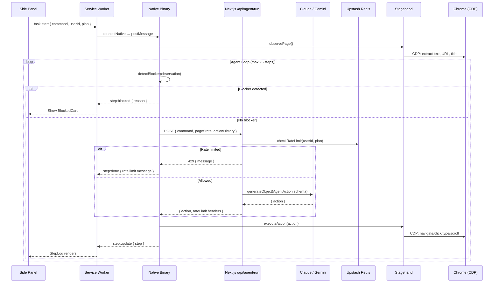

# Phase 3 Complete — Claude Integration + Real Agent Loop

## Architecture (Phase 3)



---

## Files Created / Modified

### `apps/web/` — Server (5 new files)
| File | Purpose |
|---|---|
| [rate-limit.ts](file:///c:/Users/rohit/OneDrive/Desktop/dart/apps/web/lib/rate-limit.ts) | Upstash sliding-window rate limiter: free=5/day, pro=30/day, power=100/day |
| [ai.ts](file:///c:/Users/rohit/OneDrive/Desktop/dart/apps/web/lib/ai.ts) | Model selection: Gemini Flash (free) / Claude Sonnet 4 (pro/power). System prompt with safety rules. User prompt builder with 5KB trim + history summarization |
| [run/route.ts](file:///c:/Users/rohit/OneDrive/Desktop/dart/apps/web/app/api/agent/run/route.ts) | POST endpoint: validate → rate limit → generateObject() → retry on failure → return action + X-RateLimit headers |
| [cancel/route.ts](file:///c:/Users/rohit/OneDrive/Desktop/dart/apps/web/app/api/agent/cancel/route.ts) | POST endpoint: set cancellation flag in Redis |
| [middleware.ts](file:///c:/Users/rohit/OneDrive/Desktop/dart/apps/web/middleware.ts) | Clerk middleware (Phase 3: /api/agent/* public for testing) |

### `packages/agent/` — Updated (4 files)
| File | Change | Purpose |
|---|---|---|
| [planner.ts](file:///c:/Users/rohit/OneDrive/Desktop/dart/packages/agent/src/planner.ts) | **REPLACED** | Real AI planner: calls /api/agent/run, handles rate limits, retry on failure, fallback to local patterns |
| [observer.ts](file:///c:/Users/rohit/OneDrive/Desktop/dart/packages/agent/src/observer.ts) | **UPGRADED** | Full page text extraction via TreeWalker, 4.5KB budget, formatObservation() for prompts |
| [blocker-detector.ts](file:///c:/Users/rohit/OneDrive/Desktop/dart/packages/agent/src/blocker-detector.ts) | **NEW** | Heuristic CAPTCHA/2FA/rate-limit/login detection via text patterns + DOM iframe check |
| [loop.ts](file:///c:/Users/rohit/OneDrive/Desktop/dart/packages/agent/src/loop.ts) | **UPGRADED** | Blocker detection between observe & plan, PlannerConfig for AI, rate limit awareness |

### `packages/native/` — Updated (1 file)
| File | Change | Purpose |
|---|---|---|
| [host.ts](file:///c:/Users/rohit/OneDrive/Desktop/dart/packages/native/src/host.ts) | **UPGRADED** | Forwards userId/plan/authToken to agent loop's PlannerConfig |

### `apps/extension/` — Updated (1 file)
| File | Change | Purpose |
|---|---|---|
| [background.ts](file:///c:/Users/rohit/OneDrive/Desktop/dart/apps/extension/entrypoints/background.ts) | **MODIFIED** | Passes placeholder userId/plan/authToken to native binary |

---

## Build Verification

```
✓ pnpm install — 32 new packages (Clerk, Upstash, Vercel AI SDK, @ai-sdk/anthropic, @ai-sdk/google)
✓ Extension build — 293.61 KB, zero errors, 846ms
✓ Web app typecheck — zero errors (tsc --noEmit)
✓ All Zod schemas validate end-to-end
```

## How to Test Phase 3

### 1. Set up environment variables
```bash
cp .env.example .env.local
# Fill in:
# - ANTHROPIC_API_KEY (for Claude Sonnet — pro/power)
# - GOOGLE_AI_API_KEY (for Gemini Flash — free tier)
# - UPSTASH_REDIS_REST_URL + TOKEN (for rate limiting)
# - CLERK keys (optional in Phase 3 — auth routes are public)
```

### 2. Start the Next.js server
```bash
pnpm --filter @dart/web dev
```

### 3. Start the extension
```bash
pnpm --filter @dart/extension dev
```

### 4. Install the native agent
```powershell
$env:DART_CRX_ID="your-extension-id"; .\packages\native\scripts\dev-install.ps1
```

### 5. Test commands
- **"go to twitter.com and post a tweet saying hello world"** — Claude plans each step
- **"search for best restaurants in NYC"** — navigates + searches
- **Any 6th task on free tier** — gets rate limited with clear message

---

## Phase 3 Boundary — What Works
- ✅ **Claude plans each step** based on real page state (URL + text content)
- ✅ **Model selection per plan**: Gemini Flash (free) / Claude Sonnet 4 (pro/power)
- ✅ **Rate limiting**: 5/day free, 30/day pro, 100/day power (sliding window)
- ✅ **Blocker detection**: CAPTCHA, 2FA, rate limit, login wall → pauses + notifies
- ✅ **Safety rules**: Never enters credentials, refuses harmful requests
- ✅ **Retry logic**: AI retry on validation failure, API retry on network error
- ✅ **Token budget**: Page state trimmed to 5KB, history summarized at 20+ entries
- ✅ **Graceful fallback**: If API unreachable, falls back to simple pattern matching
- ✅ **Rate limit headers**: X-RateLimit-Remaining/Reset/Limit on every response

## Deliberately Deferred
- SSE streaming for thinking indicator → Phase 4
- Polished step UI → Phase 4
- Real Clerk auth → Phase 5
- Task persistence to DB → Phase 5
- Multi-tab support → Phase 6
